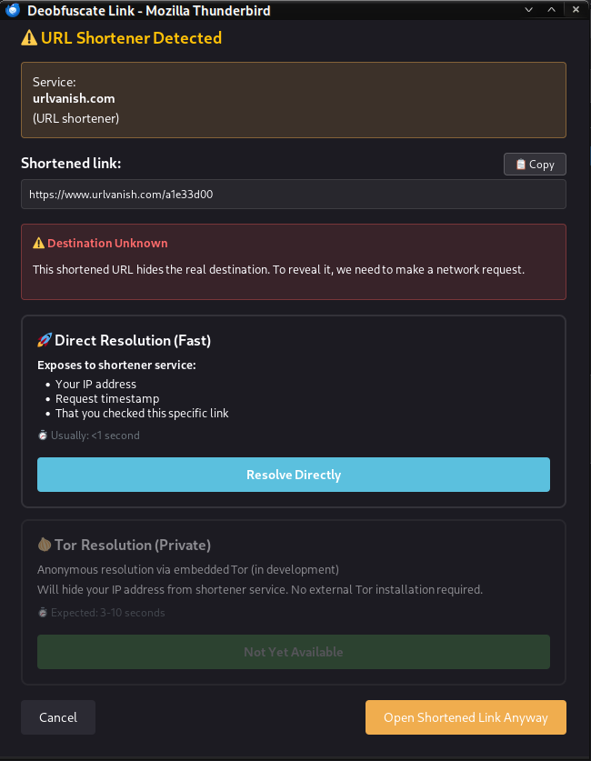
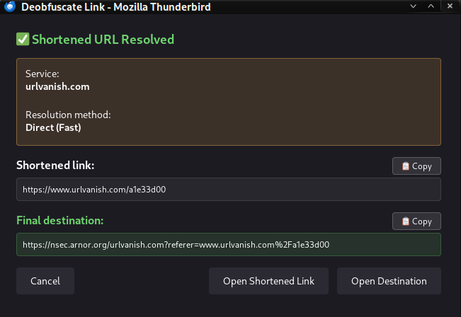

# 🔗 Thunderbird Deobfuscator

> A powerful Thunderbird extension that reveals the real destination of obfuscated email security links and shortened URLs with privacy-preserving resolution options.

[](https://github.com/renaudallard/deobfuscator/releases/latest)
[](LICENSE)
[](https://www.thunderbird.net)

---

## ✨ Features

### 🎯 **Universal Protection Coverage**
Supports 18+ email security services including Microsoft, Proofpoint, Mimecast, Barracuda, Cisco, AWS SES, and more.

### 🔄 **Multi-Layer URL Rewriting Support**
Automatically peels off multiple layers of URL rewriting when attackers chain several protection services together (e.g., Safe Links wrapping Proofpoint wrapping the real URL). The popup shows the full chain of services that were removed.

### 🔗 **URL Shortener Support with Privacy Controls**
Detects and resolves shortened URLs (bit.ly, tinyurl.com, t.co, etc.) with clear privacy warnings.
- **🚀 Direct Resolution** (fast, <1s) - Available now
- **🧅 Tor Resolution** (private, in development) - Anonymous via embedded Tor

### ⚠️ **Automatic Detection & Warning**
Warning button automatically appears in the message toolbar when opening emails containing obfuscated links, showing the exact count of protected URLs detected.

### 🖱️ **Simple Right-Click Interface**
Right-click any protected or shortened link → Select "Deobfuscate Link" → See the real destination or choose resolution method.

### 🎨 **Beautiful Theme-Aware Popup**
- Clean, modern interface that respects your system theme (light/dark mode)
- Shows both original and decoded URLs side-by-side
- One-click copy buttons for easy URL sharing
- Clear privacy warnings before any network requests

### 🔒 **Privacy-First Design**
- All protection service processing happens locally in Thunderbird
- No automatic URL resolution - always requires user consent
- Clear privacy warnings explain what information is exposed
- No external servers or tracking for protection services
- Original emails remain completely unchanged

### 🌐 **Opens in Your Browser**
Decoded URLs open in Firefox (or your default browser), not within Thunderbird.

---

## 🛡️ Supported Services

### Email Security Services (18+)

<table>
<tr>
<td width="50%">

**Enterprise Solutions**
- ✅ Microsoft Safe Links
- ✅ Proofpoint URL Defense (v2 & v3)
- ✅ Mimecast URL Protect
- ✅ Barracuda Link Protection
- ✅ Cisco Secure Email
- ✅ Check Point Harmony Email
- ✅ Symantec/Broadcom Messaging Gateway
- ✅ Trend Micro Email Security
- ✅ FireEye/Trellix
- ✅ AWS SES Click Tracking (awstrack.me)

</td>
<td width="50%">

**Additional Services**
- ✅ Sophos Email Security
- ✅ Trustwave MailMarshal
- ✅ Egress Defend
- ✅ Hornetsecurity ATP
- ✅ OpenText/EdgePilot
- ✅ Intermedia
- ✅ PostOffice
- ✅ Generic URL protection services

</td>
</tr>
</table>

### URL Shorteners (26+)

**Popular Services**
- ✅ bit.ly / bitly.com
- ✅ TinyURL (tinyurl.com)
- ✅ Twitter (t.co)
- ✅ Google (goo.gl)
- ✅ Ow.ly
- ✅ is.gd
- ✅ Buff.ly

**Social Media & Enterprise**
- ✅ LinkedIn (lnkd.in)
- ✅ YouTube (youtu.be)
- ✅ Facebook (fb.me)
- ✅ Amazon (amzn.to)
- ✅ eBay (ebay.us)
- ✅ Rebrandly (rebrand.ly)

**Privacy-Focused Services**
- ✅ URLVanish (urlvanish.com)

**Additional Shorteners**
- ✅ adf.ly, bc.vc, clck.ru, db.tt, ity.im, q.gs, qr.ae, qr.net, smarturl.it, su.pr, trib.al, u.to, v.gd, x.co, zip.net, zpr.io, and more!

---

## 📦 Installation

### For Users

1. Download `deobfuscator.xpi` from [Releases](https://github.com/yourusername/deobfuscator/releases)
2. Open Thunderbird
3. Go to **Add-ons and Themes** (≡ menu → Add-ons and Themes)
4. Click the gear icon ⚙️ → **Install Add-on From File…**
5. Select the downloaded `deobfuscator.xpi` file

### For Developers

1. Clone this repository
2. Open Thunderbird → **Add-ons and Themes**
3. Click gear icon ⚙️ → **Debug Add-ons**
4. Click **Load Temporary Add-on…**
5. Navigate to the `src/` folder and select `manifest.json`

---

## 🚀 Usage

### For Email Security Links (Instant Deobfuscation)

1. **Open an email** with a protected link
2. **Look for the warning** — A warning button automatically appears in the message toolbar showing:
   ```
   ⚠️ Warning: 3 Obfuscated Links ⚠️
   ```
3. **Right-click** on any obfuscated URL
4. **Select** "Deobfuscate Link" from the context menu
5. **Review** the popup showing:
   - 📄 **Original link**: The wrapped/protected URL
   - ✅ **Clean URL**: The real destination
6. **Choose an action**:
   - 🟢 **Open Clean Link** — Opens the decoded URL (recommended)
   - 🔴 **Open Original Link** — Opens the wrapped URL (if needed)
   - ⚪ **Cancel** — Close without action
   - 📋 **Copy** — One-click copy either URL to clipboard

**Example:**

**Before:** `https://nam12.safelinks.protection.outlook.com/?url=https%3A%2F%2Fexample.com`

**After:** `https://example.com`

**Multi-layer example:**

**Before:** `https://nam12.safelinks.protection.outlook.com/?url=https%3A%2F%2Furldefense.proofpoint.com%2Fv2%2Furl%3Fu%3Dhttps-3A__example.com`

**After:** `https://example.com` (2 layers removed: Microsoft Safe Links, Proofpoint URL Defense)

---

### For URL Shorteners (Privacy-Aware Resolution)

1. **Open an email** with a shortened link (bit.ly, tinyurl.com, etc.)
2. **Right-click** on the shortened URL
3. **Select** "Deobfuscate Link" from the context menu
4. **Review the warning** — Extension detects shortener and shows:
   ```
   ⚠️ URL Shortener Detected
   Service: bit.ly (URL shortener)
   ⚠️ Destination Unknown
   ```
5. **Choose resolution method**:

   **🚀 Direct Resolution (Fast)**
   - Exposes to shortener: Your IP address, timestamp, that you checked this link
   - Speed: Usually <1 second
   - Click: **"Resolve Directly"**

   **🧅 Tor Resolution (Private)** — *In development*
   - Will hide your real IP (uses Tor exit node)
   - Anonymous resolution via embedded Tor
   - Expected speed: 3-10 seconds
   - Status: Not yet available

6. **After resolution**, see the final destination:
   - 📄 **Shortened link**: bit.ly/abc123
   - ✅ **Final destination**: https://example.com/real/page

7. **Choose an action**:
   - 🟢 **Open Destination** — Opens the resolved URL (recommended)
   - 🔴 **Open Shortened Link** — Opens the shortener URL
   - ⚪ **Cancel** — Close without action

**Example:**

**Before:** `https://bit.ly/3xY2zQ`

**Privacy Warning → User Confirms → Resolution**

**After:** `https://example.com/real/destination/page`

---

### Privacy Guarantees

**Email Security Links:**
- ✅ 100% local processing
- ✅ No network requests
- ✅ Instant results

**URL Shorteners:**
- ✅ Detection happens locally (no network)
- ⚠️ Resolution requires network request
- ✅ Always asks permission first
- ✅ Clear warnings about privacy trade-offs
- ✅ User chooses between speed and privacy
- 🚫 Never resolves automatically

---

## 🛠️ Building from Source

A build script is included for your convenience:

```bash
./build.sh
```

This creates `deobfuscator.xpi` from the `src/` directory with all necessary files.

**Manual build:**
```bash
cd src
zip -r ../deobfuscator.xpi *
```

---

## 📁 Project Structure

```
deobfuscator/
├── src/
│   ├── background.js              # Core deobfuscation logic, shortener detection & resolution
│   ├── popup.html                 # Popup UI with multiple views (protection/shortener/resolved)
│   ├── popup.js                   # Popup behavior, resolution flow & clipboard functionality
│   └── manifest.json              # Extension manifest (v2)
├── build.sh                       # Build script
├── deobfuscator.xpi               # Packaged extension
└── README.md                      # This file
```

---

## 🔧 Technical Details

### Architecture

The extension uses a **multi-tier detection and resolution system**:

#### Tier 1: Automatic Detection (Zero Privacy Cost)
1. **Message Monitoring**: Listens for `messageDisplay.onMessageDisplayed` events
2. **Content Scanning**: Fetches and scans message body for obfuscated link patterns
3. **Visual Warning**: Displays warning button in message toolbar with link count
4. **Real-time Updates**: Warning appears/disappears as you switch messages
5. **Shortener Detection**: Identifies 25+ URL shortener services by domain pattern

#### Tier 2a: Email Security Service Deobfuscation (Local)
1. **Right-Click**: User right-clicks any link in the message
2. **Analysis**: Background script identifies the protection service or shortener
3. **Multi-Layer Unwrapping**: Iteratively peels off nested protection layers (up to 10 deep) until the real URL or a shortener is reached
4. **Display**: Shows both URLs in themed popup window, with the full chain of services removed
5. **Action**: Opens selected URL in default browser

#### Tier 2b: URL Shortener Resolution (Privacy-Aware)
1. **Detection**: Identifies shortened URL (bit.ly, tinyurl, etc.)
2. **Privacy Warning**: Shows clear warning about what data will be exposed
3. **User Consent**: User explicitly chooses resolution method
4. **Direct Resolution**:
   - First tries HTTP HEAD request (minimal data transfer)
   - Falls back to GET only if needed
   - Follows redirects automatically
   - Parses HTML for meta refresh/JavaScript redirects as last resort
5. **Tor Resolution** *(in development)*: Will use embedded Tor (anonymous, slower)
6. **Display**: Shows original and resolved URLs
7. **Action**: User decides which URL to open

This approach works around Thunderbird's security restrictions on `owl://` and `imap://` protocols.

### Deobfuscation Methods

**Email Security Services:**
- **Microsoft Safe Links**: Extracts `url` parameter
- **Proofpoint v2**: Custom character substitution decode
- **Proofpoint v3**: Path-based extraction
- **Generic Services**: Tries common parameter names (`url`, `u`, `dest`, `target`, etc.)
- **Multi-Layer**: Iterative unwrapping of nested protection services (up to 10 layers deep), with full service chain displayed in the popup

**URL Shorteners:**
- **Detection**: Domain pattern matching (local, no network)
- **Direct Resolution**:
  - Tries HTTP HEAD request first (minimal data transfer, privacy-friendly)
  - Falls back to GET only if HEAD doesn't work
  - Follows HTTP redirects automatically
  - Parses HTML for meta refresh and JavaScript redirects as last resort
- **Tor Resolution** *(in development)*: Arti (Tor in WebAssembly) for anonymous resolution

### Security & Privacy

**Email Security Links:**
- ✅ All processing is local
- ✅ No network requests
- ✅ No data collection
- ✅ Instant results

**URL Shorteners:**
- ✅ Detection is local (no network)
- ⚠️ **Third-Party Querying:** Resolution involves the add-on querying the shortener service directly. This is functionally equivalent to clicking the original link, but the action is triggered by the add-on *without* the user clicking the link in the email body.
- ⚠️ Resolution requires network request (exposes your IP)
- ✅ Always asks permission first
- ✅ Clear warnings about privacy trade-offs
- ✅ User chooses between speed and privacy
- 🚫 Never resolves automatically

**General:**
- ✅ Minimal permissions required
- ✅ No external servers or tracking
- ✅ Open source and auditable

---

## 🎨 Screenshots

### Popup Window (Light Mode)
Clean, modern interface showing original and decoded URLs with action buttons.



### Popup Window (Dark Mode)
Automatically adapts to your system theme for comfortable viewing.



---

## ⚙️ Configuration

No configuration needed! The extension works out of the box with sensible defaults.

---

## 🤝 Contributing

Contributions are welcome!

### Adding Email Security Service Support

1. Edit `src/background.js`
2. Add hostname detection in `deobfuscateUrl()`
3. Add service name in `identifyService()`
4. Test with sample URLs
5. Submit a pull request

### Adding URL Shortener Support

1. Edit `src/background.js`
2. Add domain to `SHORTENER_DOMAINS` array
3. Test detection and resolution
4. Submit a pull request

---

## 📝 Version History

### v0.1.0 (Current)
- ✨ Initial release
- 🛡️ Support for 17+ email security services
- 🔗 URL shortener detection (26+ services including URLVanish)
- 🚀 Direct shortener resolution with privacy warnings
- 🔒 Privacy-friendly HTTP HEAD requests (minimal data transfer)
- ⚠️ Automatic detection with warning indicator in message toolbar
- 🎨 Theme-aware popup interface with multiple views
- 📋 Copy-to-clipboard functionality
- 🌐 Opens URLs in default browser
- 🔐 Privacy-first design with explicit user consent

### v0.2.0 (In Development)
- 🔄 Multi-layer URL rewriting support: iteratively unwraps nested protection services
- 🧅 Embedded Tor support for anonymous shortener resolution (via Arti WebAssembly)
- ⚙️ User preferences and settings page
- 📊 Bulk shortener resolution for multiple links in one email
- 🎯 Improved resolution success rate

---

## 📄 License

This project is licensed under the MIT License - see the [LICENSE](LICENSE) file for details.

---

## 🙏 Acknowledgments

- Built for Thunderbird 102+
- Designed with privacy and security in mind
- Community-driven development

---

## 💬 Support

- 🐛 **Found a bug?** [Open an issue](https://github.com/yourusername/deobfuscator/issues)
- 💡 **Have a suggestion?** [Start a discussion](https://github.com/yourusername/deobfuscator/discussions)
- 📧 **Need help?** Check the [Wiki](https://github.com/yourusername/deobfuscator/wiki)

---

<div align="center">

**Made with ❤️ for the Thunderbird community**

[⬆ Back to Top](#-thunderbird-deobfuscator)

</div>
